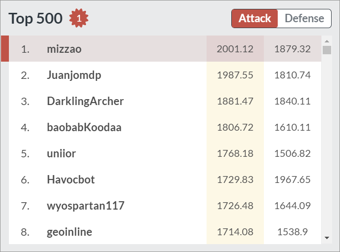

# Bot Land Scripts

This repo contains TypeScript code for controlling bots on [Bot
Land](https://play.bot.land). Bot Land is an RTS game where you control your
units programmatically instead of manually. This code, with appropriate tactical
use, reached #1 on the Bot Land attack leaderboard in October 2019:

These bots allow you to execute a variety of strategies. If you're familiar with
units from Starcraft 2 / Warcraft 3, these bots are analogous to:

- micro / blink Stalkers that kite enemies
- "Siege Tanks" (artillery) that micro and lay mines
- specialists in melee combat
- a cloaking melee unit that does splash damage
- cloak rushing the enemy CPU
- supporting other units (medic, repair, etc.)

Except, now you can micro your units perfectly via code instead of with your
fingers. For example, check out this 5vs12 battle using missiles and landmines:

## Getting Started

This is a JavaScript/TypeScript project, and requires that you have [NodeJS] and
[Yarn] installed on your system first. Then, do the following:

1. Clone this repository: `git clone https://github.com/mizzao/bot.land.git`.
2. Install local dependencies: `yarn install`.
3. Build the bot code: `yarn build`.

Bots will show up in the `build` directory. If you have any problems, create an
[issue].

We recommend you use [VS Code] to work with this repo if you don't already have
an editor of choice, as it will automatically set up most of the tools used
here. You can use the `Run Build Task` (`Ctrl+Shift+B` by default) command to
build all the bots.

[vs code]: https://code.visualstudio.com/
[nodejs]: https://nodejs.org/en/download/
[yarn]: https://yarnpkg.com/lang/en/docs/install/
[issue]: https://github.com/mizzao/bot.land/issues

## Features

Bot Land uses a reduced dialect of JavaScript where all variables are global and
code is written as a single file. Obviously, this makes it difficult to use
modern development conveniences like type checking, code reuse, and sharing code
between bots. This repo is my attempt to fix some of those issues and make it
more fun to write code for bots. It includes the following, much of which is
provided by [TypeScript]:

- Static and inferred types for the Bot Land API
- Code isolation and reuse (using Typescript and project references)
- Incremental builds (Typescript 3.4)
- Fine control on how source `*.ts` files get compiled into target `*.js` files
- Code formatting and linting (Prettier and Tslint)

For more information on how we set up TypeScript to transpile to a format that
Bot Land will accept, see [this StackOverflow question][soq].

[typescript]: https://www.typescriptlang.org/
[soq]: https://stackoverflow.com/q/58278709/586086

## Commands

Several commands are available as yarn scripts: `yarn <command>`, which you can
see in [package.json](package.json). The ones of note are:

- `build` and `build-clean` to compile all bots
- `format` and `lint` to format code and check for common errors
- `botland` strips out all `var` keywords in the output and converts all
  variables to global.

## Add New Bots

If you want to write new bots, first fork this repo. Then:

1. Copy any bot folder (i.e. `Sneaktillery`) to a new folder `<NewBot>`.
2. Rename the bot (e.g. `Sneaktillery.ts` --> `<NewBot>.ts`).
3. Edit the `<NewBot>/tsconfig.json` to set `files` and `outFile` with the name of the new bot.
4. Edit [`tsconfig.json`](tsconfig.json) and add a reference to `<NewBot>`.

If you like your new bot and it works well, consider opening a [pull
request][pr] to share your code with the community.

[pr]: https://github.com/mizzao/bot.land/pulls

## Known Issues

Because Bot Land uses an "eccentric" version of JavaScript, you should keep in
mind that not everything written in standard TypeScript will transfer verbatim
to your code. For example, all local variables will be global: `const foo = 42;`
in a function may be overwriting an existing value of `foo` that you may be
using elsewhere. Using TypeScript means we are protected against using
undeclared variables in local function scopes; however if you want to use
stateful global variables explicitly it is a good idea to declare them with
`declare let GLOBAL_FOO;` at the top of your bot file.

Shared variables and arrays also have an non-standard interaction, which will be
documented later.

## Bugs / Questions

Can't find an answer to your question here? Open an [issue] or discuss this code
on the [Bot Land Discord][discord].

[discord]: https://discordapp.com/channels/135765168289349632/631603408771481629
